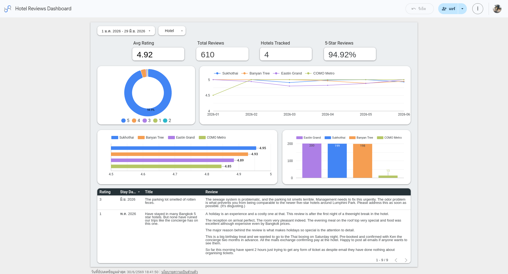

# Hotel Reviews — Scraping & Analytics Pipeline

An automated, **free-tier** cloud data pipeline that scrapes TripAdvisor hotel reviews,
loads them into **BigQuery**, and visualizes trends in **Looker Studio**. Built to run
itself on a monthly schedule with zero manual steps.

## 📊 Live Dashboard

[**View the live Looker Studio dashboard →**](https://lookerstudio.google.com/reporting/c6da7188-5769-4e6f-a699-47b45d2d4ef6)

Tracks 4 competing luxury hotels in Bangkok's **Sathorn** district — average rating, rating
distribution, monthly trend per hotel, and the latest low-rated reviews. Reads BigQuery
directly and refreshes automatically each month.



## Architecture

```
Cloud Scheduler (monthly cron)
  └─► Cloud Run Job (Docker: src/main.py)
        ├─ Apify:    scrape TripAdvisor reviews (multiple hotels)
        ├─ pandas:   clean / normalize
        └─ BigQuery: MERGE into reviews table (dedup by review_id)
              └─► Looker Studio dashboard (reads BigQuery directly)
```

CI/CD: every push to `main` triggers **GitHub Actions** to build the Docker image,
push it to **Artifact Registry**, and update the Cloud Run Job.

## Tech stack

| Layer | Tool |
|-------|------|
| Scraping | Apify (`maxcopell/tripadvisor-reviews`) |
| Processing | Python + pandas |
| Warehouse | Google BigQuery |
| Orchestration | Cloud Run Job + Cloud Scheduler |
| Container registry | Artifact Registry |
| Secrets | Secret Manager |
| CI/CD | GitHub Actions |
| Dashboard | Looker Studio (free) |

## How it works

1. **Scrape** — loops over `HOTEL_URLS`, pulling reviews from Apify with a rolling
   `LOOKBACK_MONTHS` window (default 2 months) so each run only fetches recent reviews.
2. **Normalize** — builds a DataFrame with BigQuery-friendly columns and a deterministic
   `review_id = SHA256(page_url + reviewer + date_of_stay + review_text)` used as the dedup key.
3. **Load** — writes to a staging table (`WRITE_TRUNCATE`), then `MERGE`s into `reviews`
   (`WHEN NOT MATCHED INSERT`), so re-runs never create duplicates (idempotent).

## BigQuery schema (`hotel_reviews.reviews`)

| Column | Type | Notes |
|--------|------|-------|
| `review_id` | STRING | SHA256 dedup key |
| `hotel_name` | STRING | |
| `page_url` | STRING | |
| `reviewer` | STRING | |
| `review_title` | STRING | |
| `review_text` | STRING | |
| `date_of_stay` | DATE | TripAdvisor gives month+year → day defaults to 01 |
| `rating` | INT64 | |
| `scraped_at` | TIMESTAMP | |

## Environment variables

Copy `.env.example` to `.env` and fill in:

| Variable | Required | Default | Description |
|----------|----------|---------|-------------|
| `API_TOKEN` | ✅ | — | Apify API token |
| `HOTEL_URLS` | ✅ | — | Comma-separated TripAdvisor hotel URLs |
| `RATING_SET` | | `5,4,3,2,1` | Ratings to include |
| `POST_DATE` | | first of month, `LOOKBACK_MONTHS` ago | Override the lookback start (filters by review post date) |
| `LOOKBACK_MONTHS` | | `2` | Rolling window size |
| `MAX_ITEMS` | | `1000` | Max reviews per hotel (caps Apify cost) |
| `LANGUAGE` | | `en` | Review language |
| `GCP_PROJECT_ID` | ✅ | — | GCP project |
| `BQ_DATASET` | ✅ | — | BigQuery dataset |
| `BQ_TABLE` | ✅ | — | BigQuery table |
| `BQ_LOCATION` | | `asia-southeast3` | BigQuery location |
| `GOOGLE_APPLICATION_CREDENTIALS` | local only | — | Path to a service-account key (not needed on Cloud Run) |

## Running locally

```bash
# install deps (uv)
uv sync

# run the pipeline (reads .env)
python src/main.py

# quick config check
(cd src && python -c "from main import get_config; print(get_config())")
```

### With Docker

```bash
docker build -t hotel-reviews-pipeline:local .
docker run --rm --env-file .env \
  -v "$(pwd)/<service-account-key>.json:/secrets/key.json:ro" \
  -e GOOGLE_APPLICATION_CREDENTIALS=/secrets/key.json \
  hotel-reviews-pipeline:local
```

> Note: `.env` must use `KEY=VALUE` (no spaces around `=`) for `docker --env-file`.

## Deploying (Cloud Run Job)

```bash
# run the job now
gcloud run jobs execute hotel-reviews-pipeline --region=asia-southeast3

# view run history
gcloud run jobs executions list --job=hotel-reviews-pipeline --region=asia-southeast3
```

On Cloud Run the service account is attached directly (no key file); `API_TOKEN` is read
from Secret Manager and other config from job env vars.

### Service accounts (least-privilege)

Each step runs as its own service account with only the permissions it needs — no shared
broad-access identity:

| Service account | Roles | Used by |
|-----------------|-------|---------|
| `hotel-reviews-pipeline` | BigQuery User + Data Editor, Secret Accessor | Cloud Run Job at runtime (scrape → load) |
| `github-deployer` | Artifact Registry Writer, Run Admin, Service Account User | GitHub Actions CI/CD (build → push → deploy) |
| `scheduler-invoker` | Run Invoker | Cloud Scheduler (triggers the monthly job) |

## Cost control (stays free)

- **Apify** is the only paid component (free $5 credit/month) — capped via number of hotels,
  `MAX_ITEMS`, and a monthly (not daily) schedule.
- BigQuery, Cloud Run, Cloud Scheduler, and Artifact Registry stay within free tier at this scale.
- A $1 Budget Alert is set in GCP Billing as a backstop.

## Project layout

```
src/main.py                  # the pipeline (scrape → normalize → load)
Dockerfile                   # multi-stage build (uv + python:3.14-slim)
.github/workflows/deploy.yml # CI/CD: build → push → deploy on push to main
hotel_Scrap_analysis.ipynb   # original exploratory notebook (kept for reference)
.env.example                 # configuration template
```
